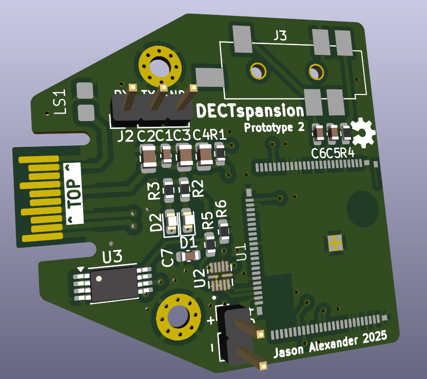

# DECTspansion 

A DECT module for your EMFCamp Tildagon badge. 

Requires a headphone input. 

Based on [sc14cvmdect-devboard](https://github.com/funkeleinhorn/sc14cvmdect-devboard) by [funkeleinhorn](https://github.com/funkeleinhorn) and [EMFCamp](https://www.emfcamp.org/) [hexpansion](https://github.com/emfcamp/badge-2024-hardware/tree/main/hexpansion). 

Currently in early prototype stage. 

## Components 

| Component | Value          | Footprint      |
|-----------|----------------|----------------|
| C1        | 47pF           | 0603           |
| C2        | 2.2uF          | 0805           |
| C3        | 10uF           | 0805           |
| C4        | 2.2uF          | 0805           |
| C5        | 100nF          | 0603           |
| C6        | 1nF            | 0603           |
| C7        | 47pF           | 0603           |
| C8        | 1uF            | 0402           |
| C9        | 1uF            | 0402           |
| D1        | OSK40603C1E    | 0603           |
| D2        | ORH-B36G       | 0603           |
| J2        | 1x3 Pin header | 2.54mm         |
| J3        | SJ-4351X       | SMT audio jack |
| J4        | 1x2 Pin header | 2.54mm         |
| R1        | 1K             | 0603           |
| R2        | 470R           | 0603           |
| R3        | 470R           | 0603           |
| R4        | 1K             | 0603           |
| R5        | 1K             | 0603           |
| R6        | 1K             | 0603           |
| U1        | SC14VCMDECT    |                |
| U2        | 74AVC4T3144    | XQFN12         |
| U3        | ZD24C64A       | TSSOP-8        |
